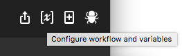
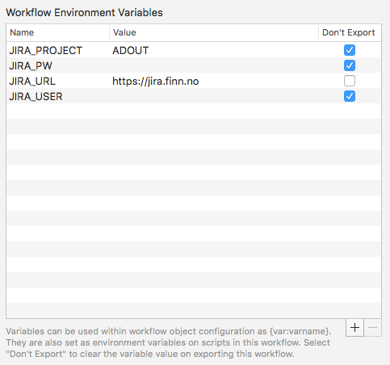
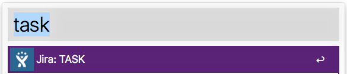
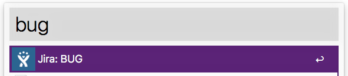
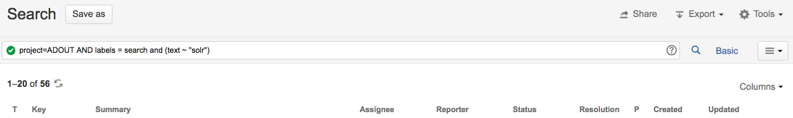
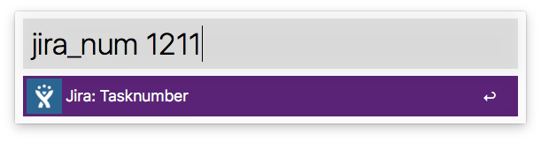

# alfred_jira_workflow
Jira workflow for Alfred.  Search, create tasks, etc

##Setup
Enterb your JIRA-credentials in the "Configure workflow and variables":

## Commands
List of commands: [task](#task), [bug](#bug), [impr](#impr), [mp](#mp), [jira_search](#jira_search), [jira_num](#jira_num)
### task
Enter a new JIRA-issure of type Task:

Keyword: jira_new, task
### bug
Enter a new JIRA-issure of type Bug:

Keyword: jira_bug, bug
### impr
Enter a new JIRA-issure of type Market Problem:

Keyword: jira_impr, impr
### mp
Enter a new JIRA-issure of type Market Problem:

Keyword: jira_mp, mp
### jira_search
Search your project.

Keyword: jira_search
### jira_num
Jump directly to an isse

Keyword: jira_search
